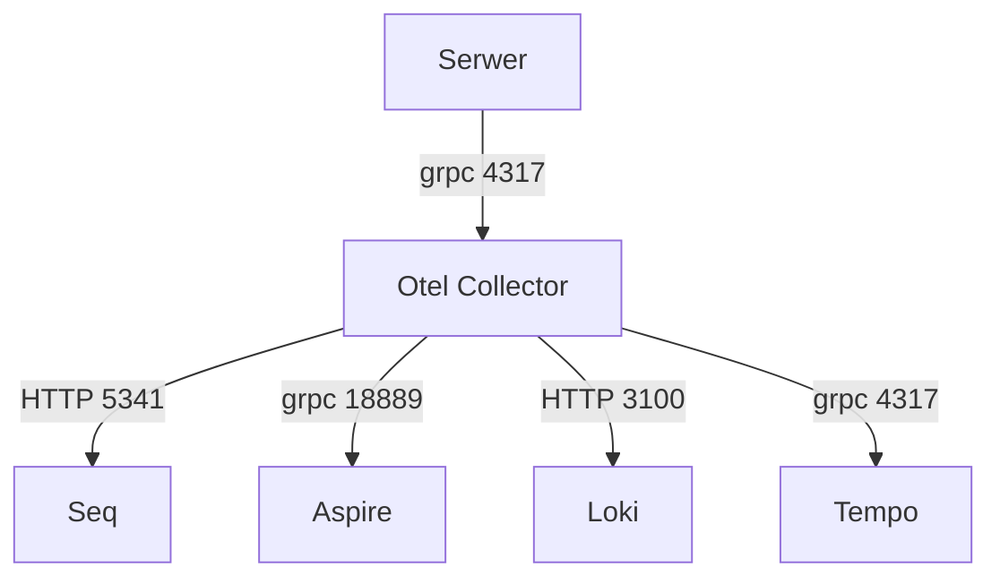

## Otello web api

.Net poc app showing how to use open telemetry colector and seq. In this scenario server app is monitoring vendor angostic. App push logs to collector, then collector push data to seq (or other services in future).



Steps to run

- stop local windows seq if installed or other container that use port 5341 - running other seq instance 

- run docker-compose (docker compose up -d) (from infra directory)

- run application, you should see starting logs at localhost:5341 seq UI. 

- hit http://localhost:5080/api/test (GET) to trigger error log

## Seq


## .NET Aspire


## Grafana Loki
query used:
```
{service_name="Otello"}
```


## Grafana Tempo
query used:

```
{resource.service.name="Otello" && name="GET /api/test"} 
```
