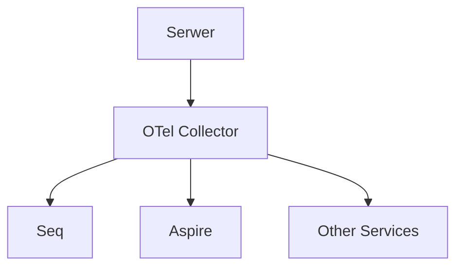

## Infrastructure Readme

Logging directly to seq is no longer availabile. However you will see logs and traces in seq, but it will be send by otel collector, then to seq. It will allow send observability data to other services with no changes in server source code in the future. 

Steps to run

- stop local windows seq if installed or other container that use port 5341 - running other seq instance 

- run docker-compose (docker compose up -d)

- run application, you should see starting logs at localhost:5341 seq UI. 
